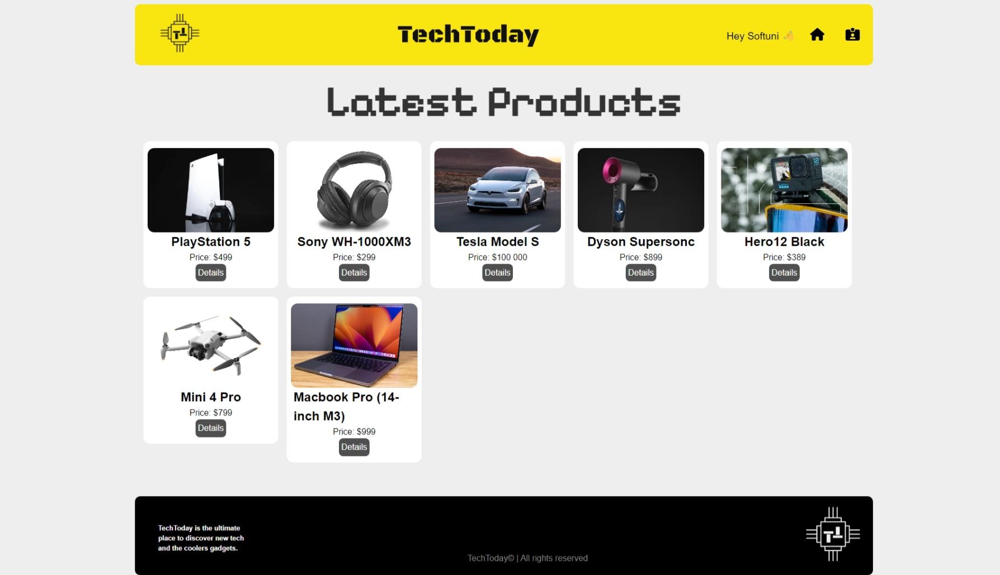

# TechToday React Project Documentation



## About The Project
TechToday is a dynamic platform designed for technology enthusiasts to explore and share the latest gadgets. The site operates on a crowd-sourced model, allowing users to contribute by adding new consumer electronics and engaging in discussions through comments.

This project serves the purpose of fulfilling the requirements of the React JS October 2023 Course offered by SoftUni.

## Running the Project
### Server
This project uses the SoftUni Practice Server. To start the server, execute the following command in your console:
```
node server
```

### Vite
This project utilizes Vite. To launch the development server, run the following command: 
```
npm run dev
```

## Technical Functionality
1. Public Part
    1. Catalog / Home page
    2. Product Details
    3. Route Guards

2. Authentication & Authorization
    1. Register
    2. Logout
    3. Login
    4. Error handling
    5. Form data validation 
    6. Authorization: only product owners can edit or delete their products

3. CRUD
    1. Create a new product
    2. Read product details 
    3. Update product detail (only product owners can edit or delete their products)
    4. Delete product (only product owners can edit or delete their products)
4. Comments
    1. Guest can view comment section
    2. Registered users can post new comments

## Used Tools
* ReactJS
* Vite
* [SoftUni Practice Server](https://github.com/softuni-practice-server/softuni-practice-server)
* Google Fonts
* Font Awesome
